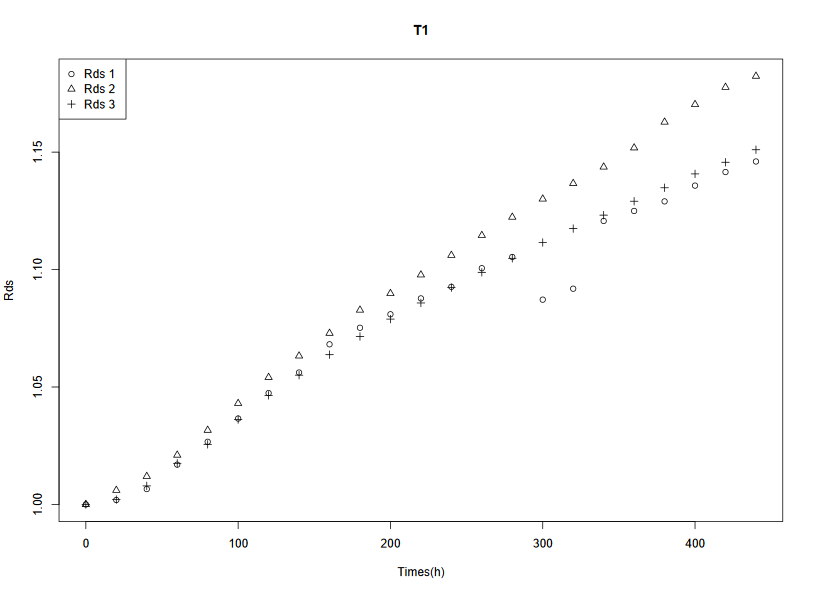
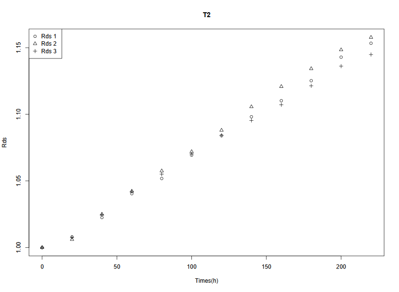
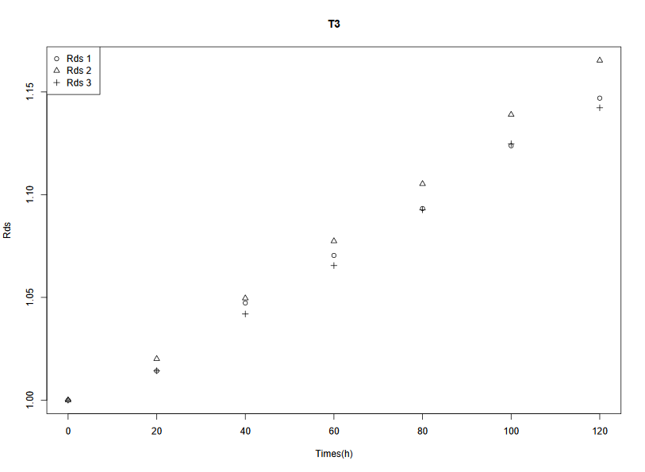

# R：由RDS分析SSPC性能退化


## 1. 案例介绍
可测量的RDS指标从SSPC开始工作到产品失效时刻会呈现出一定的变化规律，本案例中我们借助RDS指标分析SSPC的性能退化趋势。

## 2. 基于Wiener过程的性能退化模型

### (1) 实验预处理及可视化

首先采集RDS数据。每20h采集一次，实验有T1、T2、T3三个应力水平，每个应力水平下有3个样本。详见下表：

表1 RDS的性能退化数据

T1

|时长|样本1|样本2|样本3|
|:---:|:---:|:---:|:---:|
|0|41.543|39.854|40.65|
|20|41.621|40.094|40.734|
|40|41.815|40.33|40.971|
|60|42.247|40.691|41.362|
|80|42.651|41.113|41.69|
|100|43.062|41.568|42.12|
|120|43.512|42.01|42.538|
|140|43.876|42.374|42.887|
|160|44.375|42.759|43.242|
|180|44.668|43.152|43.557|
|200|44.906|43.434|43.858|
|220|45.187|43.749|44.137|
|240|45.392|44.081|44.402|
|260|45.721|44.419|44.667|
|280|45.92|44.729|44.91|
|300|45.165|45.037|45.183|
|320|45.359|45.301|45.424|
|340|46.557|45.58|45.657|
|360|46.734|45.905|45.898|
|380|46.903|46.342|46.131|
|400|47.182|46.641|46.371|
|420|47.422|46.933|46.572|
|440|47.609|47.121|46.789|

T2

|时长|样本1|样本2|样本3|
|:---:|:---:|:---:|:---:|
|0|39.571|40.213|41.028|
|20|39.886|40.457|41.346|
|40|40.462|41.217|42.042|
|60|41.171|41.911|42.759|
|80|41.622|42.526|43.288|
|100|42.315|43.107|43.913|
|120|42.893|43.752|44.485|
|140|43.455|44.461|44.942|
|160|43.932|45.072|45.425|
|180|44.526|45.611|46.008|
|200|45.225|46.179|46.613|
|220|45.638|46.556|46.972|

T3

|时长|样本1|样本2|样本3|
|:---:|:---:|:---:|:---:|
|0|40.511|39.776|40.227|
|20|41.087|40.575|40.804|
|40|42.427|41.749|41.914|
|60|43.364|42.855|42.862|
|80|44.288|43.962|43.954|
|100|45.527|45.302|45.246|
|120|46.465|46.352|45.951|

将其分别另存为`T1.csv`、`T2.csv`、`T3.csv`文件。

在研究性能退化数据分析时，常常先对数据进行初始（归一）化：

$$
\begin{equation}
X^*=\frac{X}{X_1}
\end{equation}
$$

其中，$X^*$是初始化后的数据，$X$是原始数据，$X_1$是原始数据的初始值。

使用R进行初始化与可视化：

```r
# 设置路径名
path0 <- c("T1", "T2", "T3")
path <- "Rtrials/SSPC/data/"

for (m in 1:3) {
  # 读取csv文件中的数据
  dat <- read.csv(paste(path, path0[m], ".csv", sep = ""), header = TRUE)
  # 在其副本上修改
  dat0 <- dat
  # 将数据初始化
  for (i in 2:4) {
    dat0[, i] <- dat0[, i] / dat0[1, i]
  }
  # 将初始化后的数据分别赋值给dat1、dat2、dat3
  assign(paste("dat", m, sep = ""), dat0)
}

for (m in 1:3) {
  # 将dat1、dat2、dat3分别赋值给dat
  dat <- get(paste("dat", m, sep = ""))
  # 时间赋值给t
  t <- dat[, 1]
  # 画图
  plot(x = t, y = dat[, 2], pch = 1,
       ylim = c(1, max(dat[, c(2:4)])),
       xlab = "Times(h)", ylab = "Rds",
       main = paste("T", m, sep = ""))
  points(x = t, y = dat[, 3], pch = 2)
  points(x = t, y = dat[, 4], pch = 3)
  legend("topleft", legend = c("Rds 1", "Rds 2", "Rds 3"),
         pch = 1:3)
}
```







由图可知，RDS随实验时间整体呈现上升趋势。

### (2) Wiener过程模型

（线性）Wiener过程模型的适用范围是：

1. 退化有确定趋势，且随机波动

2. 数据来回波动，不是严格单调

3. 增量近似正态、独立、平稳

4. 连续时间检测

5. 产品寿命长，实验中难观测失效

对应本案例正合适。其通常表述为

$$
\begin{equation}
X(t_i)=X(t_1)+\mu t_i+\sigma B(t_i)
\end{equation}
$$

其中，$i=2,\dots,n$，$n$是数据个数，$X(t_1)$是数据初始值，$\mu$是飘逸参数，$\sigma$是扩散参数，$B(\cdot)$是标准Brownian运动。

根据Wiener过程的独立增量性可得

$$
\begin{equation}
\Delta X(T_i)=X(t_{i+1})-X(t_i)\sim N(\mu\Delta t,\sigma^2\Delta t)
\end{equation}
$$

其中，$\Delta t$是收集数据的时间间隔。

### (3) 参数的点估计和区间估计

由(3)式可知，对Wiener过程的参数估计即对正态分布的参数估计，一般有矩估计和极大似然估计两种方法。